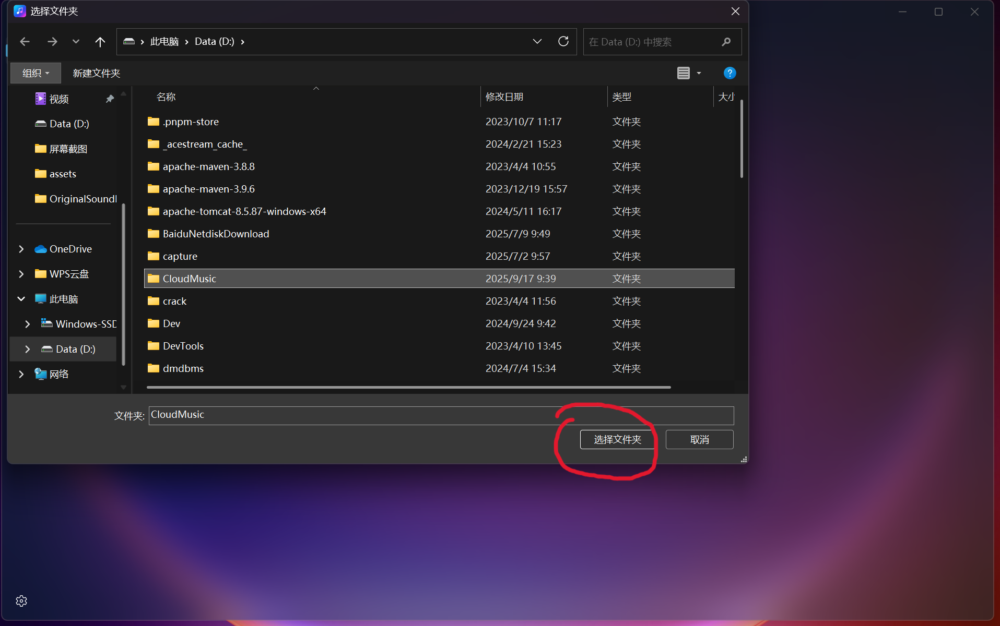

# FAQ

---

## 1. Can't download the app from Microsoft Store?

1. Download the test builds from **[GitHub Releases](https://github.com/Johnwikix/original-sound-hq-player/releases)** (provided free of charge, for testing and evaluation only).
   - The zip contains a self-signed `.msix`; install it with the bundled script: extract the zip and run `powershell -ExecutionPolicy Bypass -File .\Install.ps1` in the extracted folder (it installs the certificate and deploys the app automatically; confirm the UAC prompt; add `-Force` when upgrading).
   - Or trust the certificate manually: double-click the `.cer` → "Install Certificate" → store location "Local Machine" → check "Place all certificates in the following store" → select "Trusted People", then double-click the `.msix` to install.
2. Or visit **[https://store.rg-adguard.net](https://store.rg-adguard.net)**, enter the app's store link, and download the offline `.msix` installer package.
3. Or build directly from source: clone **[the source repository](https://github.com/Johnwikix/original-sound-hq-player)** and compile it yourself following the instructions in the repo.

---

## 2. App won't launch?

1. First, check if your system meets the minimum requirements: Windows 10, version 1809.
2. If you meet the requirements, try downloading the dependencies for your x64 architecture from **C++ Runtime packages for Desktop Bridge - Visual C++ | Microsoft Learn** and **Latest Windows App SDK Downloads - Windows apps | Microsoft Learn**. Make sure you install them with administrator privileges.
3. If the problem persists, press `Win + R` to open the Run dialog and enter `%USERPROFILE%\Documents\OriginalSoundPlayer\Logs` to navigate to the log directory and inspect the crash log.

---

## 3. Missing font icons on Windows 10?

1. Download the icons and fonts from **[https://aka.ms/SegoeFluentIcons](https://aka.ms/SegoeFluentIcons)** and **[https://aka.ms/segoemdl2](https://aka.ms/segoemdl2)**.

---

## 4. Acrylic effects aren't working?

1. Check if **Transparency effects** is enabled in your system settings under **Accessibility**.
2. If you have custom system beautification software installed, it may be causing a conflict. Try uninstalling it.

---

## 5. Music isn't showing up after I add a folder?

1. Confirm that you actually clicked **Select Folder**.
2. You can also drag and drop the folder onto the page.
